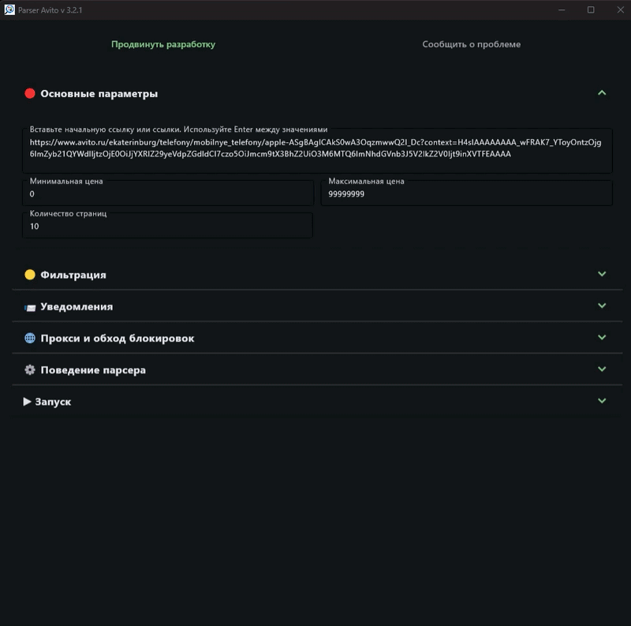

## Avito Parser

**Avito Parser** — это инструмент для автоматического мониторинга новых объявлений на Avito, с возможностью мгновенной отправки уведомлений в (TG, VK) и экспорта в Excel. Идеально подходит для продавцов, аналитиков и всех, кто следит за ценами и предложениями.


📜 **История изменений** — [смотреть](docs/CHANGELOG.md)

📚 **Документация для разработчиков** — [смотреть](docs/DOCS.md)



### Последние изменения

### [3.2.23] - 2026-09-30
#### Добавлено
- Добавлена настройка «Парсить описание полностью». Она загружает полное описание объявления вместо короткого текста из списка
- Добавлена автоматическая очистка старых логов. Логи старше 5 дней удаляются, а их общее количество ограничено

#### Исправлено
- Парсинг просмотров и полного описания теперь использует данные карточки объявления. Если включены обе настройки, данные загружаются одним запросом
- Результаты сохраняются после каждой страницы. Уже собранные объявления не потеряются, если на следующей странице возникнет ошибка
- Окно программы больше не зависает во время парсинга и корректно реагирует на кнопку «Стоп»
- Исправлены ошибки фильтра по адресу и другим параметрам, если в объявлении не хватает части данных
- Исправлено сохранение в Excel объявлений без цены, даты, координат, фотографий и других необязательных данных
- Исправлена проверка и установка браузера Playwright в Windows, Linux и macOS
- Старые параметры в `config.toml` больше не мешают запуску программы
- При блокировке или сетевой ошибке программа корректно меняет прокси, обновляет cookies и повторяет запрос
- Увеличено время ожидания ответа сервиса cookies, чтобы медленные ответы реже приводили к ошибке

### Возможности

#### 📌 Основные
- Мониторинг новых объявлений на Avito в реальном времени
- Выгрузка найденных объявлений в Excel
- Кроссплатформенность (Windows, Linux, macOS)

#### ⚙️ Гибкие настройки
- Чёрный/белый список ключевых слов
- Фильтр по региону и продавцам
- Ограничение по времени публикации
- Парсинг количества просмотров
- Поддержка прокси (автоматический обход бана IP)
- Поддержка обхода блокировок через сторонний сервис

#### 📬 Уведомления и хранение
- Отправка уведомлений в Telegram (несколько получателей)
- Отправка уведомлений в VK (несколько получателей)
- Игнорирование уже просмотренных объявлений
- Отслеживание изменения цены
- Сохранение в Excel

#### 🚀 Производительность
- Высокая скорость работы
- Постоянная проверка в фоновом режиме
- Поддержка до 100 ссылок для отслеживания (в режиме без графического интерфейса ограничений нет)

#### 🐳 Режимы запуска
- С графическим интерфейсом (GUI)
- В консольном режиме (CLI)
- В Docker-контейнере

---

### 🎥 Обзор и видео
- [Обзор последней версии](https://youtu.be/hh4kYBfjRcA)
- [Как запустить локально и на сервере, подробная инструкция для новичков](https://youtu.be/_XQW2ApNwiQ) — хоть и про старую версию, но настоятельно рекомендую посмотреть  
- [Плейлист разработки](https://www.youtube.com/playlist?list=PLK9kK8z0fpqxPakGZvxo7y6HtCBTYihUF)

---

## 🚀 Быстрый старт (Windows)

1. Скачать архив из [релизов](https://github.com/Duff89/parser_avito/releases)
2. Запустить AvitoParser.exe
3. Заполнить настройки
4. Нажать Старт


Если по каким-то причинам предыдущий вариант не запускается - всегда можно запустить как обычный Python проект.
Для этого требуется Python 3.11+. Скопируйте проект и установите зависимости:

```bash
  pip install -r requirements.txt
```

Запустите **AvitoParser.py** (режим с графическим интерфейсом)

```bash
  python AvitoParser.py
```

Если Вам необходимо запустить парсер на сервере (режим без графического интерфейса), запускайте:

```bash
  python parser_cls.py
```

📘 Остальная документация:
- [Обход блокировок](docs/ANTIBLOCK.md)
- [Уведомления (Telegram, VK)](docs/NOTIFICATIONS.md)
- [Docker и сервер](docs/DOCKER.md)
- [Для разработчиков](docs/DOCS.md)

---

## 🛠 Обратная связь

Если нашли баг или хотите предложить улучшение — создайте issue [на GitHub](https://github.com/Duff89/parser_avito/issues).

При описании ошибки укажите:
- Вашу ОС
- Версию скрипта
- Способ запуска
- Скриншот/логи ошибки

---

### ❤️ Поддержка проекта

Если хотите, чтобы проект развивался быстрее:
- [Поддержать через YooMoney](https://yoomoney.ru/to/410014382689862)
- Переводом на карту: 2204 1201 0103 5539

---

###  📧️ Прямая связь с автором
Пожалуйста, не нужно писать на почту насчет ошибок\багов в парсере, для этого есть [issue](https://github.com/Duff89/parser_avito/issues)

 📧 Email: sergeichopolovich1989@gmail.com

> Программное обеспечение предоставляется «как есть» (as is), без явных или подразумеваемых гарантий.
Автор не гарантирует стабильную работу, соответствие ожиданиям пользователя или отсутствие ошибок.
Использование осуществляется на собственный риск пользователя. 
> Автор не несёт ответственности за любые последствия